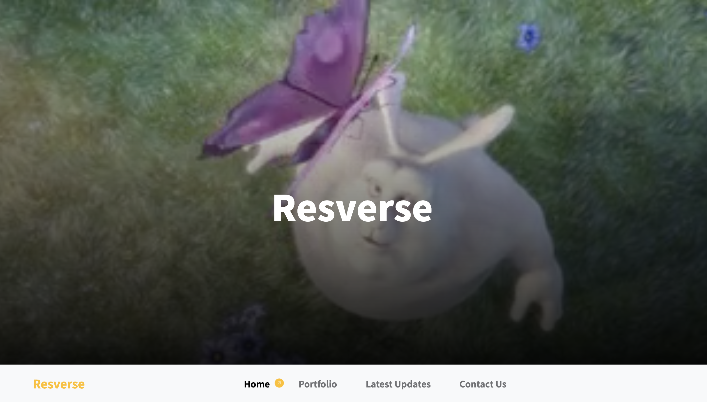
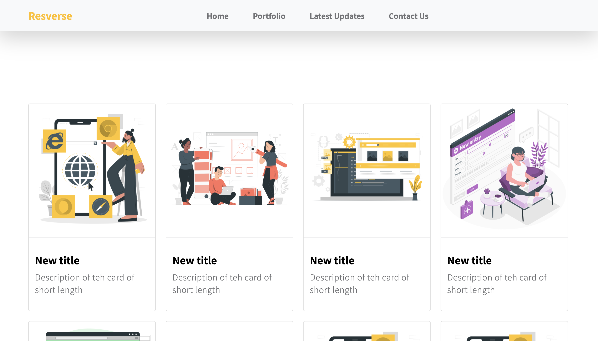
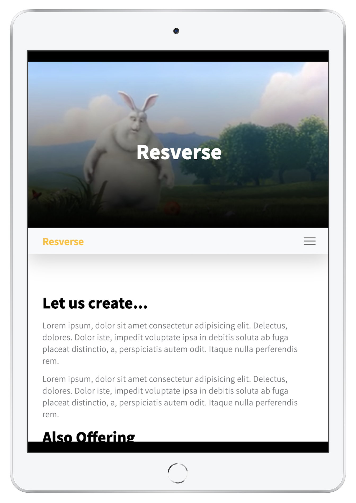
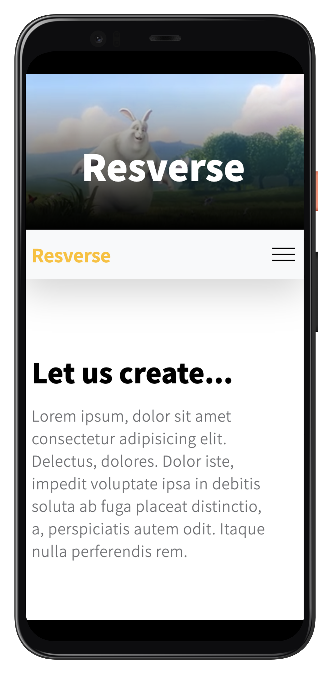

<div align="center">
  <h3 align="center">Resverse</h3>

  <p align="center">
    An awesome Theme to jumpstart your projects!
    <br />
  </p>
</div>


<!-- TABLE OF CONTENTS -->
<details>
  <summary>Table of Contents</summary>
  <ol>
    <li>
      <a href="#about-the-project">About The Project</a>
      <ul>
        <li><a href="#built-with">Built With</a></li>
      </ul>
    </li>
    <li>
      <a href="#getting-started">Getting Started</a>
      <ul>
        <li><a href="#prerequisites">Prerequisites</a></li>
        <li><a href="#installation">Installation</a></li>
      </ul>
    </li>
    <li><a href="#features">Features</a></li>
    <li><a href="#contact">Contact</a></li>
    
  </ol>
</details>


<!-- ABOUT THE PROJECT -->
## About The Project
<br>

<br><br>
There are many themes available in the market, What's special in Resverse?

Here's the answer:
* Your time should be focused on creating something amazing. A project that solves a problem and helps others
* You shouldn't be doing the same tasks over from scratch
* Complete Responsive theme for mobile, tablets or any device width.
<br><br><br>

<br><br>
Of course, no theme will serve all projects since your needs may be different. So I'll be adding more in the near future. 


<p align="right">(<a href="#top">back to top</a>)</p>


### Built With

This theme was built using following frameworks & libraries:

* [HTML5](/)
* [CSS3]()
* [Bootstrap](https://getbootstrap.com)
* [Javascript]()
* [JQuery](https://jquery.com)

<p align="right">(<a href="#top">back to top</a>)</p>


<!-- GETTING STARTED -->
## Getting Started


### Prerequisites

No prequistes

### Installation

_Below is an example of how you can instruct your audience on installing and setting up your app. This template doesn't rely on any external dependencies or services._


1. Clone the repo
   ```sh
   git clone https://github.com/tiwari-alok/Resverse.git
   ```
2. Open Index.html flie in any internet browser

<p align="right">(<a href="#top">back to top</a>)</p>


<!-- FEATURES -->
## Features

<li>Mimalistic & clean</li>

<li>Responsive with all range of devices available</li>

<li>Compact & fast</li>

<!-- CONTACT -->
## Contact

Alok Tiwari - [@iam_anoob](https://twitter.com/iam_anoob) - alok.tiwari@srijan.net


<p align="right">(<a href="#top">back to top</a>)</p>


<!-- MARKDOWN LINKS & IMAGES -->
<!-- https://www.markdownguide.org/basic-syntax/#reference-style-links -->
[contributors-shield]: https://img.shields.io/github/contributors/othneildrew/Best-README-Template.svg?style=for-the-badge
[contributors-url]: https://github.com/othneildrew/Best-README-Template/graphs/contributors
[forks-shield]: https://img.shields.io/github/forks/othneildrew/Best-README-Template.svg?style=for-the-badge
[forks-url]: https://github.com/othneildrew/Best-README-Template/network/members
[stars-shield]: https://img.shields.io/github/stars/othneildrew/Best-README-Template.svg?style=for-the-badge
[stars-url]: https://github.com/othneildrew/Best-README-Template/stargazers
[issues-shield]: https://img.shields.io/github/issues/othneildrew/Best-README-Template.svg?style=for-the-badge
[issues-url]: https://github.com/othneildrew/Best-README-Template/issues
[license-shield]: https://img.shields.io/github/license/othneildrew/Best-README-Template.svg?style=for-the-badge
[license-url]: https://github.com/othneildrew/Best-README-Template/blob/master/LICENSE.txt
[linkedin-shield]: https://img.shields.io/badge/-LinkedIn-black.svg?style=for-the-badge&logo=linkedin&colorB=555
[linkedin-url]: https://linkedin.com/in/othneildrew
[product-screenshot]: images/screenshot.png
